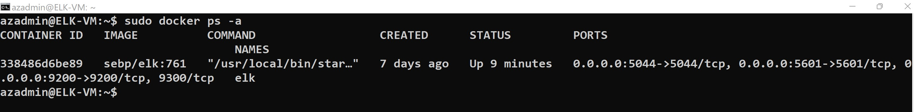

## Automated ELK Stack Deployment

The files in this repository were used to configure the network depicted below.

These files have been tested and used to generate a live ELK deployment on Azure. They can be used to either recreate the entire deployment pictured above. Alternatively, select portions of the file may be used to install only certain pieces of it, such as Filebeat.

  - [DVWA Webserver Playbook](Ansible/roles/dvwa-playbook.yml)
  - [Install ELK Playbook](Ansible/roles/install-elk.yml)
  - [Filebeat Playbook](Ansible/roles/filebeat-playbook.yml)
  - [Metricbeat Playbook](Ansible/roles/metricbeat-playbook.yml)

This document contains the following details:

- Description of the Topology
- Access Policies
- ELK Configuration
  - Beats in Use
  - Machines Being Monitored
- How to Use the Ansible Playbooks

### Description of the Topology

The main purpose of this network is to expose a load-balanced and monitored instance of DVWA, the D*mn Vulnerable Web Application.

Load balancing ensures that the application will be highly Available, in addition to restricting Access to the network.

What aspect of security do load balancers protect? 
- Redundancy, Availability

What is the advantage of a jump box? 
- A jump box is used to harden and monitor and to control access to other internal devices/machines

Integrating an ELK server allows users to easily monitor the vulnerable VMs for changes to the log files and system metrics.

What does Filebeat watch for? 
What does Metricbeat record? 

These Beats allows us to collect the following information from each machine:

- Filebeat: Monitor and collects log files.
- Metricbeats: system resources like CPU and memory statistics.

The configuration details of each machine may be found below.

_Note: Use the [Markdown Table Generator](http://www.tablesgenerator.com/markdown_tables) to add/remove values from the table_.

| Name          | Function                    | Private IP Address | Public IP Address | Operating System        |
|---------------|-----------------------------|--------------------|-------------------|-------------------------|
| JumpBox       | Gateway                     | 10.0.0.4           | 20.213.136.125    | Ubuntu Server 20.04 LTS |
| Web01         | DVWA-Web Application Server | 10.0.0.5           | N/A               | Ubuntu Server 20.04 LTS |
| Web02         | DVWA-Web Application Server | 10.0.0.6           | N/A               | Ubuntu Server 20.04 LTS |
| Web03         | DVWA-Web Application Server | 10.0.0.7           | N/A               | Ubuntu Server 20.04 LTS |
| ELK-VM        | ELK Stack                   | 10.1.0.4           | 20.222.210.197    | Ubuntu Server 20.04 LTS |

### Access Policies

The (Web VMs) machines on the internal network are not exposed to the public Internet. 

Only the JumpBox and ELK-VM (Kibana) machines can accept connections from the Internet. Access to this machine is only allowed from the following IP addresses:

- My Home Public IP Address (172.88.230.226)

Machines within the network can only be accessed by JumpBox.

A summary of the access policies in place can be found in the table below.

| Name                 | Publicly Accessible | Allowed IP Addresses                                    |
|----------------------|---------------------|---------------------------------------------------------|
| JumpBox              | Yes                 | My Home Public IP Address  &  10.0.0.0/16 (Same subnet) |
| ELK-VM               | Yes                 | My Home Public IP Address  &  Subnet IP (10.0.0.0/16)   |
| Web01                | No                  | Subnet 10.1.0.0/16                                      |
| Web02                | No                  | Subnet 10.1.0.0/16                                      |
| Web03                | No                  | Subnet 10.1.0.0/16                                      |

### Elk-VM Configuration

Ansible was used to automate configuration of the ELK-VM machine. No configuration was performed manually, which is advantageous because it allows a consistent and predictable configuration. In addition to consistency, with an automated setup, the ELK-VM can be created and configured very quickly.  

The playbook implements the following tasks:

1. Configure maximum mapped memory with "sysctl" module
2. Install "docker.io" and "python3-pip" packages using "apt" module
3. Install docker "python" package with "pip"
4. Enable systemd docker service
5. Run ELK docker container

The following screenshot displays the result of running `docker ps -a` after successfully configuring the ELK instance.

#### Target Machines & Beats
This ELK server is configured to monitor the following machines:

- Web01: 10.0.0.5
- Web02: 10.0.0.6
- Web03: 10.0.0.7

We have installed the following Beats on these machines:

- Filebeat
- Metricbeat

These Beats allows us to collect the following information from each machine:

- Filebeat parses and forwards system logs from the Web VMs to the ELK-VM in a readable format.
- Metricbeat reports system and service statistics about the Web VMs to the ELK-VM.

### Using the Playbook (install-elk.yml)
In order to use the playbook, you will need to have an Ansible control node already configured. Assuming you have such a control node provisioned: 

SSH into the control node and follow the steps below:

- Copy the install-elk.yml playbook file to: /etc/ansible/roles/
    directory inside the ansible container.
    - $ sudo docker cp install-elk.yml <container.name>:/etc/ansible/roles/install-elk.yml

- Update the [/etc/ansible/hosts](Ansible/hosts) file to include the ELK-VM Servers/IP address.
  - Append "ansible_python_interpreter=/usr/bin/python3" to ensure that the correct version of python is used.

- Run the playbook, and navigate to Kibana (http://20.222.210.197:5601/app/kibana#/home) to check that the installation worked as expected.

Answer the following questions to fill in the blanks:

- Which file is the playbook? Where do you copy it? The file is "install-elk.yml", we copy it to the path: "/etc/ansible/roles/"

- Which file do you update to make Ansible run the playbook on a specific machine? How do I specify which machine to install the ELK server on versus which to install Filebeat on? 

we update the "hosts" file as following:

[webservers]
10.0.0.5 ansible_python_interpreter=/usr/bin/python3 
10.0.0.6 ansible_python_interpreter=/usr/bin/python3
10.0.0.7 ansible_python_interpreter=/usr/bin/python3

# Used to install filebeats on Webservers VMs

[elk]
10.1.0.4 ansible_python_interpreter=/usr/bin/python3

# Used to install ELK Server on Elk-VM

- Which URL do you navigate to in order to check that the ELK server is running?
http://20.222.210.197:5601/app/kibana#/home

_As a **Bonus**, provide the specific commands the user will need to run to download the playbook, update the files, etc._

(The commands are based on my setup/configuration)

- ssh azadmin@20.213.136.125
- sudo docker start agitated_perlman
- sudo docker attach agitated_perlman
- cd ../..
- cd etc/ansible
- nano hosts (update IP addresses for web vms and elk vm
- nano ansible.cfg (add the username for the remote user to which server you want to use)
- cd roles/
- ansible-playbook install-elk.yml
- ansible-playbook filebeat-playbook.yml
- ansible-playbook metricbeat-playbook.yml
